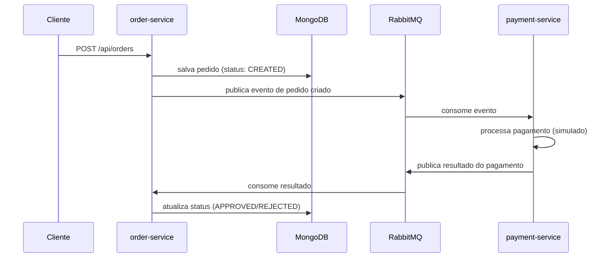

# E-commerce Microservices

Protótipo de arquitetura de microsserviços para processamento de pedidos e pagamentos, construído com **Spring Boot 3**, **Java 21**, **MongoDB** e **RabbitMQ**. O objetivo do projeto é demonstrar comunicação assíncrona orientada a eventos entre serviços independentes, com persistência poliglota e execução containerizada.

## Índice

- [Visão geral](#visão-geral)
- [Arquitetura](#arquitetura)
- [Stack técnica](#stack-técnica)
- [Estrutura do projeto](#estrutura-do-projeto)
- [Como executar](#como-executar)
- [API](#api)
- [Testes](#testes)
- [Variáveis de ambiente](#variáveis-de-ambiente)
- [Roadmap](#roadmap)
- [Licença](#licença)

## Visão geral

O sistema é composto por dois serviços independentes que se comunicam via mensageria:

| Serviço | Responsabilidade | Porta | Banco de dados |
|---|---|---|---|
| `order-service` | Recebe e persiste pedidos, expõe API REST, atualiza status a partir do resultado do pagamento | `8080` | MongoDB |
| `payment-service` | Consome pedidos criados, simula o processamento de pagamento e publica o resultado | `8081` | — (stateless) |

A comunicação entre os serviços não é síncrona (sem chamadas REST diretas entre eles): todo o fluxo acontece através de filas no RabbitMQ, o que reduz acoplamento e permite que cada serviço evolua e escale de forma independente.

## Arquitetura



**Fluxo resumido:**

1. O cliente cria um pedido via API REST (`order-service`).
2. O pedido é persistido no MongoDB com status `CREATED`.
3. Um evento é publicado no RabbitMQ para notificar que um novo pedido existe.
4. O `payment-service` consome o evento e simula a aprovação/recusa do pagamento.
5. O resultado é publicado de volta no RabbitMQ.
6. O `order-service` consome o resultado e atualiza o status do pedido (`APPROVED` ou `REJECTED`).

## Stack técnica

- **Java 21** + **Spring Boot 3.2**
- **Spring Web** — exposição de API REST
- **Spring Data MongoDB** — persistência do agregado `Order`
- **Spring AMQP (RabbitMQ)** — mensageria assíncrona entre serviços
- **Maven** (multi-módulo) — build e gerenciamento de dependências
- **Docker / Docker Compose** — orquestração local de todos os componentes
- **JUnit 5 + Testcontainers** — testes de integração com MongoDB real em container
- **Lombok** — redução de boilerplate

## Estrutura do projeto

```
ecommerce-microservices/
├── docker-compose.yml          # Orquestra MongoDB, RabbitMQ e os dois serviços
├── pom.xml                     # POM pai (multi-módulo Maven)
├── order-service/
│   ├── src/main/java/com/ecommerce/order/
│   │   ├── controller/         # Endpoints REST
│   │   ├── service/             # Regras de negócio (cálculo de total, atualização de status)
│   │   ├── domain/              # Entidades persistidas no MongoDB
│   │   ├── dto/                 # Contratos de entrada/saída e eventos
│   │   ├── repository/          # Acesso a dados (Spring Data MongoDB)
│   │   ├── listener/             # Consumidores RabbitMQ
│   │   └── config/               # Configuração de filas
│   └── src/test/                # Testes de integração
└── payment-service/
    └── src/main/java/com/ecommerce/payment/
        ├── listener/             # Consumidores/produtores RabbitMQ
        ├── dto/                  # Contratos de eventos
        └── config/               # Configuração de filas e conversor JSON
```

## Como executar

### Pré-requisitos

- Docker e Docker Compose
- JDK 21 e Maven (apenas se for rodar/buildar fora do Docker)

### Subindo tudo com Docker Compose

O `docker-compose.yml` já orquestra o MongoDB, o RabbitMQ e os dois serviços, incluindo healthcheck do RabbitMQ para garantir a ordem correta de inicialização.

```bash
# build dos artefatos Java (necessário antes do build das imagens)
./mvnw clean package -DskipTests

# sobe toda a stack
docker compose up --build
```

Serviços disponíveis após o start:

- `order-service` → http://localhost:8080
- `payment-service` → http://localhost:8081
- RabbitMQ Management UI → http://localhost:15672 (usuário/senha padrão: `guest` / `guest`)
- MongoDB → `localhost:27017`

### Rodando localmente sem Docker

```bash
# a partir da raiz do projeto
./mvnw clean install

# em terminais separados
cd order-service && ./mvnw spring-boot:run
cd payment-service && ./mvnw spring-boot:run
```

Nesse modo, é necessário ter uma instância de MongoDB e RabbitMQ rodando localmente (ou expostas via Docker) e ajustar as variáveis de ambiente conforme a seção abaixo.

## API

### `order-service`

| Método | Endpoint | Descrição |
|---|---|---|
| `POST` | `/api/orders` | Cria um novo pedido |
| `GET` | `/api/orders/{id}` | Consulta um pedido pelo ID |

**Exemplo de requisição:**

```bash
curl -X POST http://localhost:8080/api/orders \
  -H "Content-Type: application/json" \
  -d '{
        "customerId": "user-123",
        "items": [
          { "productId": "prod-001", "quantity": 2, "price": 49.90 }
        ]
      }'
```

**Resposta:**

```json
{
  "id": "665f1c2e8b3a...",
  "customerId": "user-123",
  "items": [ { "productId": "prod-001", "quantity": 2, "price": 49.90 } ],
  "totalAmount": 99.80,
  "status": "CREATED",
  "createdAt": "2026-08-26T10:15:00"
}
```

O status do pedido é atualizado de forma assíncrona para `APPROVED` ou `REJECTED` assim que o `payment-service` processa o pagamento.

## Testes

O `order-service` conta com testes de integração usando **Testcontainers**, subindo uma instância real de MongoDB em container para validar a criação de pedidos de ponta a ponta.

```bash
cd order-service
./mvnw test
```

## Variáveis de ambiente

| Variável | Serviço | Padrão | Descrição |
|---|---|---|---|
| `SPRING_DATA_MONGODB_URI` | order-service | `mongodb://mongodb:27017/ordersdb` | String de conexão do MongoDB |
| `SPRING_RABBITMQ_HOST` | order-service, payment-service | `rabbitmq` | Host do RabbitMQ |
| `SPRING_RABBITMQ_USERNAME` | order-service | `guest` | Usuário do RabbitMQ |
| `SPRING_RABBITMQ_PASSWORD` | order-service | `guest` | Senha do RabbitMQ |

## Roadmap

Próximos passos planejados para evoluir o protótipo:

- [ ] Padronizar os nomes das filas e o payload trafegado entre `order-service` e `payment-service` (hoje há dessincronia entre o nome das filas configuradas em cada serviço)
- [ ] Trafegar o evento completo (`OrderCreatedEvent`) em vez de apenas o ID do pedido na fila de criação
- [ ] Adicionar Dead Letter Queue (DLQ) e retry policy para mensagens com falha de processamento
- [ ] Adicionar idempotência no processamento de eventos (evitar duplicidade em caso de reentrega)
- [ ] Expor endpoint de listagem de pedidos com paginação
- [ ] Adicionar testes de integração no `payment-service`
- [ ] Adicionar observabilidade (logs estruturados, tracing distribuído, métricas)
- [ ] Adicionar API Gateway e service discovery caso novos serviços sejam adicionados

## Licença

Este projeto é distribuído sob a licença MIT. Sinta-se livre para utilizá-lo como referência de estudo.